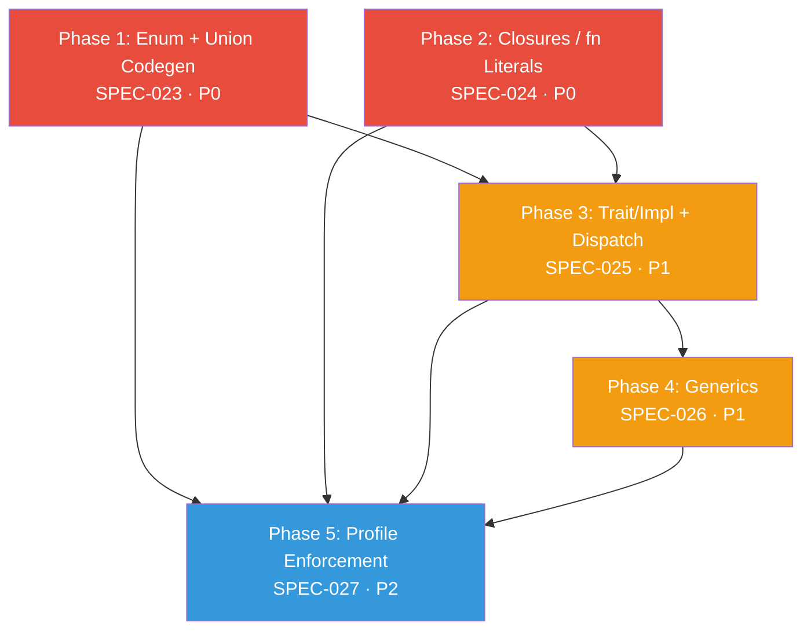
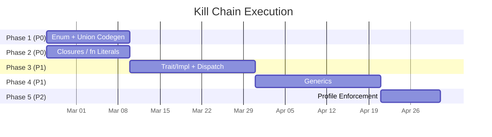

<!--
SPDX-License-Identifier: LUL-1.0
Copyright (c) 2026 Self Sovereign Society Foundation
-->

**Voxis Forge Signal** ⚡

# Kill Chain Roadmap — Core Completion

**Version:** 1.0.0
**Status:** **DRAFT (Ratification Pending)**
**Authority:** Constitutional
**Date:** 2026-02-22

This roadmap sequences the 5 strategic gaps that block Janus from transitioning from "promising compiler" to "usable language." Each phase has a formal BDD specification, verified source references, and a clear dependency chain.

---

## Dependency Graph

**Legend:** P0 = Critical (blocks idiomatic programs) · P1 = High (blocks polymorphism) · P2 = Strategic (blocks profile system)

---

## Phase 1: Enum + Union Codegen

**Priority:** P0 — Blocks idiomatic `:core` programs
**Depends on:** Nothing
**Unlocks:** Pattern matching on enum variants, tagged union destructuring, idiomatic data modeling
**Spec:** [SPEC-023-enum-union-codegen.md](../specs/SPEC-023-enum-union-codegen.md)

### Current State

| Pipeline Stage | Status | Reference |
|:---|:---|:---|
| AST NodeKinds | `enum_decl` (line 268), `union_decl` (line 267) | `compiler/astdb/core.zig` |
| Parser | **MISSING** — No `parseEnumDeclaration()` or `parseUnionDeclaration()` | `compiler/libjanus/janus_parser.zig` |
| QTJIR OpCodes | **MISSING** — No enum/union-specific OpCodes | `compiler/qtjir/graph.zig` |
| Lowering | **MISSING** — No `lowerEnumDecl()` | `compiler/qtjir/lower.zig` |
| LLVM Emission | **MISSING** — No enum emission | `compiler/qtjir/llvm_emitter.zig` |

### Implementation Template

Error unions already traverse the full pipeline — 5 OpCodes at `graph.zig:54-58`, lowering via `lowerStructLiteral` pattern at `lower.zig:2846`, and emission via `emitErrorUnionConstruct` at `llvm_emitter.zig:1700`. Follow this pattern for enums and unions.

### Estimated Scope

- Parser: `parseEnumDeclaration()`, `parseUnionDeclaration()` (~200 LOC)
- QTJIR: 4-6 new OpCodes (`Enum_Tag`, `Enum_Variant`, `Union_Construct`, `Union_Destructure`, `Union_Tag_Check`, `Union_Payload_Extract`)
- Lowering: `lowerEnumDecl()`, `lowerUnionDecl()`, `lowerEnumLiteral()` (~300 LOC)
- Emission: `emitEnumTag()`, `emitUnionConstruct()`, `emitUnionDestructure()` (~250 LOC)

---

## Phase 2: Closures / fn Literals

**Priority:** P0 — Blocks functions-as-values, compositional patterns
**Depends on:** Nothing (can parallel with Phase 1)
**Unlocks:** Callbacks, higher-order functions, compositional patterns
**Spec:** [SPEC-024-closures.md](../specs/SPEC-024-closures.md)

### Current State

| Pipeline Stage | Status | Reference |
|:---|:---|:---|
| Parser (3 syntaxes) | `parseFunctionLiteral` (line 2148), `parseBlockFunctionLiteral` (line 2218), `parseDoFunctionLiteral` (line 2262) | `compiler/libjanus/janus_parser.zig` |
| AST Representation | All parse as `.func_decl` — no distinct closure node | `compiler/astdb/core.zig` |
| QTJIR OpCodes | **MISSING** — No `Closure_Create` / `Closure_Call` | `compiler/qtjir/graph.zig` |
| Environment Capture | **MISSING** — No capture analysis or environment struct | — |
| Lowering | **MISSING** — No closure-aware lowering | `compiler/qtjir/lower.zig` |

### Key Challenge

The parser already handles three syntactic forms (arrow, block, do). The gap is entirely in the middle and back end: capture analysis, environment packaging, and emission as either inlined code or closure structs (function pointer + environment pointer).

### Estimated Scope

- AST: New `.closure_literal` NodeKind or closure flag on `.func_decl` (~50 LOC)
- QTJIR: 3-4 new OpCodes (`Closure_Create`, `Closure_Call`, `Closure_Env_Load`, `Closure_Env_Store`)
- Capture Analysis: Sema pass to detect free variables (~200 LOC)
- Lowering: `lowerClosureLiteral()` with environment struct construction (~250 LOC)
- Emission: Closure as `{fn_ptr, env_ptr}` pair (~200 LOC)

---

## Phase 3: Trait/Impl + Dispatch Wiring

**Priority:** P1 — Blocks polymorphism and interface abstraction
**Depends on:** Phase 1 (enums for trait method tags) + Phase 2 (closures for trait objects)
**Unlocks:** 577-line dispatch engine (`semantics_dispatch.zig`), polymorphism, interface contracts
**Spec:** [SPEC-025-trait-impl-dispatch.md](../specs/SPEC-025-trait-impl-dispatch.md)

### Current State

| Pipeline Stage | Status | Reference |
|:---|:---|:---|
| AST NodeKinds | `.trait_decl` (line 270), `.impl_decl` (line 271) | `compiler/astdb/core.zig` |
| Parser | **MISSING** — No `parseTraitDeclaration()` / `parseImplBlock()` | `compiler/libjanus/janus_parser.zig` |
| Dispatch Engine | `DispatchResolution` (line 17), `DispatchTable` (line 81) — 577 LOC, operational | `compiler/libjanus/semantics_dispatch.zig` |
| Bridge | `ConversionMethod.TraitMethod` struct (lines 16-19) — already exists | `compiler/libjanus/conversion_registry.zig` |
| Semantic Graph | **MISSING** — No `TraitDefinitionRegistry`, no `ImplBlock` storage | `compiler/libjanus/libjanus_semantic.zig` |

### Critical Gap

`FuncDecl` uses string-based types, not `TypeId`. The dispatch engine and semantic analysis cannot unify without a type bridge. The `ConversionRegistry` already has a `TraitMethod` struct — extend this as the bridge.

### Strategy

Treat trait methods as dispatch families. Extend `semantics_dispatch.zig` to register trait methods as `DispatchFamily` entries. Static dispatch = direct call. Dynamic dispatch = vtable lookup via `DispatchTable`.

### Estimated Scope

- Parser: `parseTraitDeclaration()`, `parseImplBlock()` (~300 LOC)
- Semantic: `TraitDefinitionRegistry`, `ImplBlockStorage`, type-bridge for `FuncDecl` (~400 LOC)
- Dispatch Bridge: Wire traits into `DispatchFamily` / `DispatchTable` (~200 LOC)
- Lowering: `lowerTraitDecl()`, `lowerImplBlock()`, `lowerTraitMethodCall()` (~350 LOC)
- Emission: Static dispatch (direct call) + dynamic dispatch (vtable) (~300 LOC)

---

## Phase 4: Generics

**Priority:** P1 — Blocks self-hosting stdlib
**Depends on:** Phase 3 (traits need generics for bounds: `T: Printable`)
**Unlocks:** `Vec[T]`, `HashMap[K, V]`, self-hosting stdlib in Janus
**Spec:** [SPEC-026-generics.md](../specs/SPEC-026-generics.md)

### Current State

| Pipeline Stage | Status | Reference |
|:---|:---|:---|
| AST NodeKind | `.type_param` (line 359) — placeholder only | `compiler/astdb/core.zig` |
| Parser | **MISSING** — No `parseGenericParams()` | `compiler/libjanus/janus_parser.zig` |
| Type System | `Type` union (lines 13-48) — NO generic representation | `compiler/libjanus/libjanus_semantic.zig` |
| Substitution | **MISSING** — No type parameter substitution engine | — |
| Monomorphization | **MISSING** — No monomorphization pipeline | — |

### Strategy

Monomorphization over type erasure. Each `identity[i32]` and `identity[String]` produces a distinct compiled function. This aligns with Janus's "Syntactic Honesty" doctrine — no hidden vtable costs.

### Estimated Scope

- Parser: `parseGenericParams()`, `parseGenericArgs()` (~200 LOC)
- Type System: `Type.Generic` variant, `TypeParamBinding` (~150 LOC)
- Substitution: Type parameter replacement engine (~300 LOC)
- Monomorphization: Instance cache + specialization (~400 LOC)
- Lowering/Emission: Per-instance lowering and emission (~200 LOC)

---

## Phase 5: Profile Enforcement

**Priority:** P2 — Blocks profile system as compiler feature
**Depends on:** Phase 1-4 (need features to gate)
**Unlocks:** `:core` / `:service` / `:cluster` as compiler-enforced constraints, not decoration
**Spec:** [SPEC-027-profile-enforcement.md](../specs/SPEC-027-profile-enforcement.md)

### Current State

| Pipeline Stage | Status | Reference |
|:---|:---|:---|
| Profile Taxonomy | Fully specified in SPEC-002 (6 profiles, 2 axes) | `specs/SPEC-002-profiles.md` |
| Profile Parsing | `ProfileParser` (lines 13-161), `ProfileCompiler` (lines 249-381) | `src/profile_parser.zig` |
| Feature Detection | `analyzeProfileFeatures()` (lines 48-122), `checkFeatureUsage()` (lines 125-155) | `src/profile_parser.zig` |
| Compiler Enforcement | **MISSING** — All features available in all profiles | — |

### Strategy

Add a semantic analysis pass after type checking that walks the AST, checks each node against the active profile's feature table, and emits compile errors for violations. Feature tables are static — no runtime cost.

### Estimated Scope

- Feature Tables: Profile → allowed NodeKinds / OpCodes mapping (~150 LOC)
- Sema Pass: `ProfileEnforcementPass` walking the semantic graph (~300 LOC)
- Error Diagnostics: Profile-aware error messages with upgrade suggestions (~100 LOC)
- Import Gating: Cross-profile import validation (~100 LOC)

---

## Execution Timeline

---

## Success Criteria

The kill chain is complete when:

1. All 5 specs have passing BDD test suites
2. A Janus program using enums, closures, traits, and generics compiles to native binary
3. Profile violations produce compile errors with actionable diagnostics
4. The dispatch engine resolves trait methods via `DispatchFamily`
5. `Vec[T]` can be implemented in Janus (not grafted from Zig)

---

**Ratified:** 2026-02-22
**Authority:** Markus Maiwald + Voxis Forge
**Status:** DRAFT (Ratification Pending)
