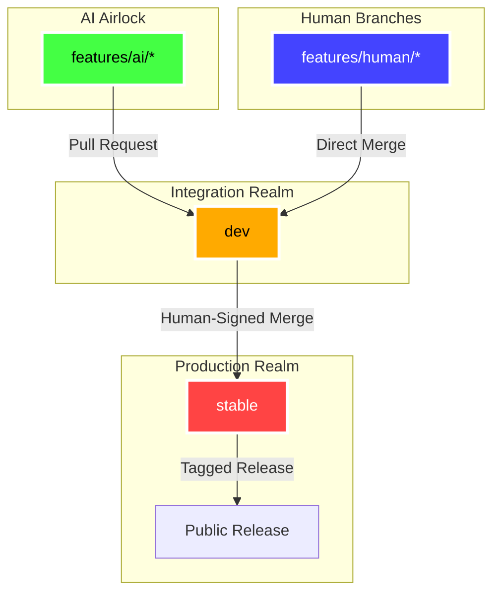

<!--
---
title: "DOCTRINE: The AI-Airlock Protocol"
status: "PROPOSED"
codename: "AIRLOCK"
version: "1.0.0"
---
-->

# DOCTRINE: The AI-Airlock Protocol

**Codename:** `AIRLOCK`  
**Status:** PROPOSED  
**Goal:** Mechanically enforce Human-in-the-Loop for AI contributions.

> "Policies are ignored; mechanisms are enforced by physics."

---

## Abstract

Until AI surpasses human capability in software engineering, we require a **cryptographic control mechanism** to govern AI contributions to the Janus language. This is not a trust-based policy—it is a **physically enforced workflow** using GPG signatures, branch protection rules, and CI gates.

The AI operates in a **contained airlock** (feature branches). Human review is the **only airlock door** to integration branches.

---

## 1. The Branch Topology



### Branch Hierarchy

| Branch | Access Level | Role | Enforcement Mechanism |
|:---|:---|:---|:---|
| **`stable`** | 🔴 **Human Council** | Production / Release | **Signed Tag Enforced.** Only specific GPG keys (Markus/Core Team) can push or merge here. |
| **`dev`** | 🟡 **Human Verifier** | Integration / Edge | **Human Signature Enforced.** AI cannot push here. AI code enters only via a Merge Commit signed by a human. |
| **`features/ai/*`** | 🟢 **AI Agent** | The Airlock | **Open Fire.** AI has full write access here to iterate on Spec/Test/Code. |
| **`features/human/*`** | 🔵 **Human Direct** | Human Development | Humans can push and merge directly to `dev`. |

---

## 2. The Mechanism (Enforcement)

We do not trust "rules". We trust **Keys**.

### A. Identity Separation

**The AI Agent** is issued a specific GPG/SSH key:
```bash
# Generate AI identity
gpg --batch --gen-key <<EOF
Key-Type: RSA
Key-Length: 4096
Name-Real: Voxis Forge AI
Name-Email: voxis-forge@janus-lang.org
Expire-Date: 1y
%no-protection
EOF
```

**The Humans** have their own personal GPG keys with restricted access.

### B. The Gatekeeper Hook (Server-Side)

We configure the git server (GitHub/GitLab/Forgejo) with the following logic:

#### Rule 1: The Ceiling
```
IF committer_key == voxis-forge-key
AND target_branch IN [dev, stable]
THEN DENY PUSH
ERROR: "AI Ceiling Reached. Open a PR."
```

#### Rule 2: The Human Seal
```
IF action == merge TO dev
THEN REQUIRE signature_valid == true
AND signer != voxis-forge-key
```

**Effect:** Even if the AI tries to merge its own PR, the system rejects it. A human *must* perform the merge action to apply their signature.

---

## 3. The Workflow (Step-by-Step)

### Step 1: Assignment (The Spec)
- **Human:** Assigns task "Implement Tag Functions" (RFC-015).
- **AI:** Creates branch `features/ai/rfc-015-tag-functions`.

### Step 2: The Forge Cycle (Inside the Airlock)
- **AI:** Writes `spec` (Acceptance Criteria - BDD format).
- **AI:** Writes failing `test`.
- **AI:** Writes `code` to pass test.
- **AI:** Pushes to `features/ai/rfc-015-tag-functions`.
  - *System:* Allows push. CI runs tests.

### Step 3: The Handover (The Review)
- **AI:** Opens Pull Request (PR) → `dev`.
- **System:** "Gatekeeper" checks verify:
  - ✅ All tests pass
  - ✅ Spec conforms to AC-BDD
  - ✅ Code coverage > 80%
  - ✅ No direct commits to protected files
- **Status:** **Blocked.** AI cannot merge.

### Step 4: The Human Seal (The Merge)
- **Human:** Reviews the "Proof Package" (Spec + Test + Code).
- **Human:** Merges the PR.
  - *Mechanism:* The merge commit is signed by the **Human's GPG Key**.
  - *Result:* Code enters `dev`.

### Step 5: Edge Testing (The `dev` Branch)
- Code runs in the "Edge" environment (nightly builds).
- If bugs are found, Human reverts or assigns AI to fix in a *new* feature branch.

### Step 6: Ascension (To `stable`)
- **Janus Language Team:** Periodically merges `dev` into `stable`.
- **Mechanism:** Requires multi-signature or specific Admin GPG key.
- **Result:** Tagged release (e.g., `v0.3.0`).

---

## 4. Technical Implementation

### A. Local Enforcement: Pre-Push Hook

Location: `.githooks/pre-push`

This hook prevents accidental AI pushes to protected branches:

```bash
#!/bin/bash
# AI-Airlock Pre-Push Hook
# Prevents AI from pushing to dev/stable

PROTECTED_BRANCHES="^(stable|dev)$"
CURRENT_BRANCH=$(git symbolic-ref HEAD | sed -e 's,.*/\(.*\),\1,')

# Check if current user is the AI agent
AI_EMAIL="voxis-forge@janus-lang.org"
CURRENT_EMAIL=$(git config user.email)

if [[ "$CURRENT_EMAIL" == "$AI_EMAIL" ]]; then
    if echo "$CURRENT_BRANCH" | grep -qE "$PROTECTED_BRANCHES"; then
        echo "❌ AI-Airlock: Cannot push to protected branch '$CURRENT_BRANCH'"
        echo "ℹ️  Create a feature branch: git checkout -b features/ai/your-feature"
        exit 1
    fi
fi

exit 0
```

### B. CI Enforcement: Gatekeeper Workflow

Location: `.github/workflows/gatekeeper.yaml` (or `.forgejo/workflows/gatekeeper.yaml`)

This workflow validates the "Proof Package" before human review:

```yaml
name: AI-Airlock Gatekeeper

on:
  pull_request:
    branches:
      - dev
      - stable

jobs:
  validate-proof-package:
    runs-on: ubuntu-latest
    steps:
      - name: Checkout
        uses: actions/checkout@v4
        with:
          fetch-depth: 0

      - name: Detect AI Authorship
        id: check-author
        run: |
          AUTHOR_EMAIL=$(git log -1 --format='%ae')
          if [[ "$AUTHOR_EMAIL" == "voxis-forge@janus-lang.org" ]]; then
            echo "ai_authored=true" >> $GITHUB_OUTPUT
            echo "🤖 AI-authored PR detected"
          else
            echo "ai_authored=false" >> $GITHUB_OUTPUT
            echo "👤 Human-authored PR detected"
          fi

      - name: Validate Proof Package (AI PRs only)
        if: steps.check-author.outputs.ai_authored == 'true'
        run: |
          echo "🔍 Validating AI Proof Package..."
          
          # Check 1: Spec exists and follows AC-BDD format
          SPEC_FILE=$(find . -name "*.md" -path "*/specs/*" -newer $(git merge-base HEAD origin/dev) | head -1)
          if [[ -z "$SPEC_FILE" ]]; then
            echo "❌ No spec file found in PR"
            exit 1
          fi
          
          # Check 2: Tests exist and pass
          if ! make test; then
            echo "❌ Tests failed"
            exit 1
          fi
          
          # Check 3: Code coverage minimum
          # (Add coverage tool here)
          
          echo "✅ Proof Package validated"

      - name: Block AI Self-Merge
        if: steps.check-author.outputs.ai_authored == 'true'
        run: |
          echo "🚫 AI cannot self-merge. Human approval required."
          echo "status=blocked" >> $GITHUB_OUTPUT
```

### C. Branch Protection Rules (GitHub/GitLab/Forgejo)

Configure on the repository settings:

**For `stable` branch:**
- ✅ Require signed commits
- ✅ Restrict push access to: `markus@janus-lang.org, core-team@janus-lang.org`
- ✅ Require pull request reviews: 2
- ✅ Require status checks to pass

**For `dev` branch:**
- ✅ Require signed commits
- ✅ Block direct pushes from `voxis-forge@janus-lang.org`
- ✅ Require pull request reviews: 1
- ✅ Require Gatekeeper workflow to pass

---

## 5. Proof Package Requirements

Every AI contribution must include:

1. **Spec** (`specs/rfc-XXX-feature-name.md`)
   - Acceptance Criteria in BDD format
   - Clear "Given/When/Then" scenarios

2. **Test** (`tests/*/test_feature_name.zig`)
   - Failing test written BEFORE implementation
   - Covers all AC scenarios

3. **Code** (`compiler/*/feature_name.zig`)
   - Minimal implementation to pass tests
   - No unexplained complexity

4. **Evidence** (CI logs)
   - Test suite passes
   - No regressions in existing tests

---

## 6. Governance Transition

**When AI > Human?**

If/when AI demonstrably exceeds human capability in software engineering:

1. The Janus Council votes to **deactivate the Airlock**.
2. AI is granted direct merge access to `dev`.
3. Human review becomes **advisory**, not **mandatory**.
4. The final gate (`stable`) remains **human-controlled** for strategic decisions.

**Until then:** The Airlock remains **active**.

---

## 7. Enforcement Checklist

- [ ] Generate AI GPG key (`voxis-forge@janus-lang.org`)
- [ ] Configure branch protection rules on git server
- [ ] Install `.githooks/pre-push` hook
- [ ] Deploy `.github/workflows/gatekeeper.yaml` CI workflow
- [ ] Document AI workflow in `CONTRIBUTING.md`
- [ ] Train AI agent on Proof Package format
- [ ] Conduct test PR to validate enforcement

---

## Appendix A: Escape Hatch (Emergency Override)

In case of critical bugs where AI assistance is needed urgently:

1. Human creates emergency branch: `hotfix/emergency-fix`
2. AI commits to this branch
3. Human cherry-picks AI commits with GPG signature
4. Human merges to `stable` with multi-sig approval

**The Airlock is never bypassed—only the Human Seal is applied retroactively.**

---

**End of Doctrine.**

This mechanism is **enforceable, auditable, and cryptographically sound**. It is not a policy—it is **physics**.
