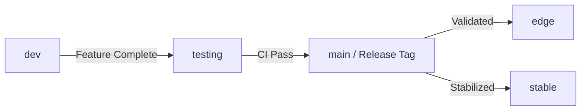

# Doctrine: The Release Cycle

> "Stability is not accidental. It is engineered."

This document codifies the "Weihnachtsmann Cycle" for verifying, staging, and deploying Janus releases.

## 1. Branch Hierarchy

| Branch | Role | Intended Audience | Risk Profile |
|--------|------|-------------------|--------------|
| **`stable`** | **LTS (Long Term Support)** | Production Users, Enterprise | **Minimal.** Only critical hotfixes. Architecture is frozen. |
| **`edge`** | **Rolling Release** | Power Users, Contributors | **Moderate.** Verified but bleeding edge. New features arrive here first. |
| **`dev`** | **Experimental Forge** | Core Developers | **High.** The chaotic forge. Frequent breaking changes. |
| **`main`** | **Release Staging** | CI/CD, Release Managers | **Low.** Staging area for tagged releases before distribution to `stable`/`edge`. |

## 2. The Promotion Flow

Code flows in one direction: from chaos to order.

## 3. Versioning Strategy

- **`stable`**: Matches `VERSION` exactly (e.g., `0.2.1`).
- **`edge`**: Matches `VERSION` with `-edge` suffix implied.
- **`dev`**: Matches `VERSION` with `-dev` suffix implied.

## 4. Release Artifacts

Every official release (`main` tag) MUST produce:
1.  **Mega-Bundle**: Containing Compiler, LSP, Standard Library, and Extension.
2.  **VS Code Extension**: `.vsix` package.
3.  **Debian Package**: `.deb` for standard Linux distribution.
4.  **Static Tarball**: `.tar.gz` for portable usage.

## 5. Automation

The `scripts/weihnachtsmann.sh` (or successor) is the canonical tool for generating these artifacts. Manual releasing is forbidden.
