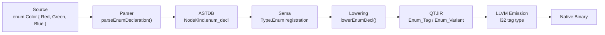

<!--
SPDX-License-Identifier: LUL-1.0
Copyright (c) 2026 Self Sovereign Society Foundation
-->

**Voxis Forge Signal** ⚡

# 🛡️ SPEC-023: Enum + Union Codegen

**Version:** 1.0.0
**Status:** **DRAFT (Ratification Pending)**
**Doctrinal Alignment:** **Syntactic Honesty + Revealed Complexity**
**Inspiration:** Rust enums, Zig tagged unions, ML algebraic data types
**Depends on:** Nothing (P0 — parallel entry point)
**Unlocks:** Pattern matching on variants (SPEC-014), idiomatic data modeling

---

## Abstract

Enums and tagged unions are the foundation of algebraic data types. Without them, Janus programs cannot model domain states, error categories, or variant data. The AST NodeKinds (`enum_decl` at `astdb/core.zig:268`, `union_decl` at line 267) exist as placeholders. This spec defines the full pipeline — from parser to LLVM emission — following the error union implementation template (`graph.zig:54-58`, `llvm_emitter.zig:1700-1792`).

---

## 1. 🜏 Pipeline Impact

| Stage | File | Change |
|:---|:---|:---|
| Parser | `compiler/libjanus/janus_parser.zig` | Add `parseEnumDeclaration()`, `parseUnionDeclaration()` |
| AST | `compiler/astdb/core.zig` | Wire existing `enum_decl` (268), `union_decl` (267) NodeKinds |
| QTJIR | `compiler/qtjir/graph.zig` | Add 6 OpCodes (see §2) |
| Lowering | `compiler/qtjir/lower.zig` | Add `lowerEnumDecl()`, `lowerUnionDecl()`, `lowerEnumLiteral()` |
| Emission | `compiler/qtjir/llvm_emitter.zig` | Add `emitEnumTag()`, `emitUnionConstruct()`, `emitUnionDestructure()` |
| Sema | `compiler/libjanus/libjanus_semantic.zig` | Add `Type.Enum` and `Type.Union` to `Type` union |

---

## 2. ⊢ Syntax + Semantics

### 2.1 Enum Declaration

[ENUM:2.1.1] An enum declares a finite set of named variants with integer tags.

```janus
enum Color {
    Red,
    Green,
    Blue,
}
```

[ENUM:2.1.2] Variants **MAY** have explicit integer values. Unspecified values auto-increment from the previous.

```janus
enum HttpStatus {
    Ok = 200,
    NotFound = 404,
    InternalError = 500,
}
```

[ENUM:2.1.3] Enum values are accessed via qualified syntax: `Color.Red`, `HttpStatus.Ok`.

### 2.2 Tagged Union Declaration

[UNION:2.2.1] A tagged union declares a set of variants, each with an optional payload.

```janus
union Shape {
    Circle { radius: f64 },
    Rect { w: f64, h: f64 },
    Point,
}
```

[UNION:2.2.2] The compiler emits a tagged struct: integer tag (i32) + payload buffer sized to the largest variant.

[UNION:2.2.3] Union construction uses qualified syntax: `Shape.Circle { radius: 3.14 }`.

### 2.3 Match Integration

[ENUM:2.3.1] Enum matching **MUST** be exhaustive (per SPEC-014). The compiler **MUST** emit a compile error if any variant is missing and no wildcard (`_`) is present.

```janus
match color {
    Color.Red => print("red"),
    Color.Green => print("green"),
    Color.Blue => print("blue"),
}
```

[UNION:2.3.2] Union matching **MUST** support payload destructuring.

```janus
match shape {
    Shape.Circle { radius } => print("circle r=", radius),
    Shape.Rect { w, h } => print("rect ", w, "x", h),
    Shape.Point => print("point"),
}
```

---

## 3. ⟁ QTJIR OpCodes

New OpCodes following the error union pattern at `graph.zig:54-58`:

```
// --- Enums ---
Enum_Tag,               // Extract integer tag from enum value
Enum_Variant,           // Construct enum value from tag constant

// --- Tagged Unions ---
Union_Construct,        // Create tagged union: { tag: variant_id, payload: value }
Union_Tag_Check,        // Check if union has specific tag: tag == variant_id
Union_Payload_Extract,  // Extract payload from union (asserts correct tag)
Union_Destructure,      // Combined tag check + payload extract for match arms
```

---

## 4. 🜏 Compilation Flow



---

## 5. BDD Scenarios

### Scenario ENUM-001: Simple enum declaration

**Profile:** `:core` | **Capability:** None

- **Given:** Source file containing `enum Color { Red, Green, Blue }`
- **When:** Compiled through the full pipeline
- **Then:** LLVM emits integer tag type (i32) with Red=0, Green=1, Blue=2
- **Invariant:** `sizeof(Color) == sizeof(i32)`

### Scenario ENUM-002: Enum with explicit values

**Profile:** `:core` | **Capability:** None

- **Given:** Source file containing `enum HttpStatus { Ok = 200, NotFound = 404 }`
- **When:** Compiled
- **Then:** Tag values match explicit assignments (Ok=200, NotFound=404)
- **Invariant:** No implicit reordering of explicit values

### Scenario ENUM-003: Exhaustive match on enum

**Profile:** `:core` | **Capability:** None

- **Given:** `match color { Color.Red => ..., Color.Green => ... }` (missing Blue)
- **When:** Compiled
- **Then:** Compile error: "non-exhaustive match: missing variant `Color.Blue`"
- **Invariant:** All variants covered OR wildcard `_` present

### Scenario ENUM-004: Enum variant as function return

**Profile:** `:core` | **Capability:** None

- **Given:** `func traffic_light() -> Color do return Color.Green end`
- **When:** Compiled and executed
- **Then:** Returns integer tag 1 (Green)
- **Invariant:** Return type matches declared enum type

### Scenario UNION-001: Tagged union declaration

**Profile:** `:core` | **Capability:** None

- **Given:** `union Shape { Circle { radius: f64 }, Rect { w: f64, h: f64 } }`
- **When:** Compiled
- **Then:** LLVM emits `{ i32, [16 x i8] }` — tag + max payload (2 × f64 = 16 bytes)
- **Invariant:** Payload buffer >= largest variant

### Scenario UNION-002: Union construction

**Profile:** `:core` | **Capability:** None

- **Given:** `let s = Shape.Circle { radius: 3.14 }`
- **When:** Compiled
- **Then:** `Union_Construct` OpCode emitted with tag=0 and payload=`{ 3.14 }`
- **Invariant:** Tag corresponds to variant declaration order

### Scenario UNION-003: Match destructure tagged union

**Profile:** `:core` | **Capability:** None

- **Given:** `match shape { Shape.Circle { radius } => radius * 2.0, Shape.Rect { w, h } => w * h }`
- **When:** Compiled
- **Then:** Tag check + payload extraction per arm, exhaustiveness enforced
- **Invariant:** Payload access guarded by tag check

### Scenario UNION-004: Union variant without payload

**Profile:** `:core` | **Capability:** None

- **Given:** `union Option { Some { value: i32 }, None }`
- **When:** `let x = Option.None` compiled
- **Then:** Tag set to None variant, payload is zero-initialized
- **Invariant:** Payloadless variants have zero-size payload contribution

---

## 6. Implementation Checklist

- [ ] **Parser:** `parseEnumDeclaration()` — parse `enum Name { Variant, ... }`
- [ ] **Parser:** `parseUnionDeclaration()` — parse `union Name { Variant { fields }, ... }`
- [ ] **AST:** Wire `enum_decl` and `union_decl` NodeKinds through AST construction
- [ ] **Sema:** Add `Type.Enum` and `Type.Union` to `Type` union in `libjanus_semantic.zig`
- [ ] **Sema:** Variant name resolution and exhaustiveness checking
- [ ] **QTJIR:** Add 6 OpCodes to `graph.zig`
- [ ] **Lowering:** `lowerEnumDecl()`, `lowerEnumLiteral()` in `lower.zig`
- [ ] **Lowering:** `lowerUnionDecl()`, `lowerUnionConstruct()`, `lowerUnionDestructure()`
- [ ] **Emission:** `emitEnumTag()`, `emitEnumVariant()` in `llvm_emitter.zig`
- [ ] **Emission:** `emitUnionConstruct()`, `emitUnionTagCheck()`, `emitUnionPayloadExtract()`
- [ ] **Tests:** One integration test per BDD scenario (ENUM-001 through UNION-004)

---

## 7. Test Traceability

| Scenario ID | Test Block | Pipeline Stages |
|:---|:---|:---|
| ENUM-001 | `test "ENUM-001: simple enum declaration"` | Parser → Sema → LLVM |
| ENUM-002 | `test "ENUM-002: enum with explicit values"` | Parser → Sema → LLVM |
| ENUM-003 | `test "ENUM-003: exhaustive match on enum"` | Parser → Sema (error) |
| ENUM-004 | `test "ENUM-004: enum variant as function return"` | Parser → Lower → LLVM → Exec |
| UNION-001 | `test "UNION-001: tagged union declaration"` | Parser → Sema → LLVM |
| UNION-002 | `test "UNION-002: union construction"` | Parser → Lower → LLVM |
| UNION-003 | `test "UNION-003: match destructure tagged union"` | Parser → Lower → LLVM → Exec |
| UNION-004 | `test "UNION-004: union variant without payload"` | Parser → Lower → LLVM |

---

## 8. Orders

1. **Commit:** Save to `specs/SPEC-023-enum-union-codegen.md`.
2. **Implementation:**
   * **Phase 1:** Parser — `parseEnumDeclaration()` and `parseUnionDeclaration()` in `janus_parser.zig`.
   * **Phase 2:** Sema + QTJIR — `Type.Enum`, `Type.Union`, 6 new OpCodes.
   * **Phase 3:** Lowering — Follow `lowerStructLiteral` pattern at `lower.zig:2846`.
   * **Phase 4:** Emission — Follow `emitErrorUnionConstruct` pattern at `llvm_emitter.zig:1700`.
   * **Phase 5:** Tests — One integration test per scenario.

**Enums and Unions are the vocabulary of data.** Without them, Janus speaks in primitive grunts. We give it algebraic eloquence.

---

**Ratified:** 2026-02-22
**Authority:** Markus Maiwald + Voxis Forge
**Status:** DRAFT (Ratification Pending)
