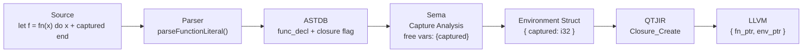

<!--
SPDX-License-Identifier: LUL-1.0
Copyright (c) 2026 Self Sovereign Society Foundation
-->

**Voxis Forge Signal** ⚡

# 🛡️ SPEC-024: Closures / fn Literals

**Version:** 1.0.0
**Status:** **DRAFT (Ratification Pending)**
**Doctrinal Alignment:** **Mechanism over Policy + Revealed Complexity**
**Inspiration:** Rust closures, Ruby blocks, Elixir anonymous functions
**Depends on:** Nothing (P0 — parallel entry point)
**Unlocks:** Functions as values, callbacks, higher-order patterns, compositional stdlib

---

## Abstract

Janus already parses three closure syntaxes — `parseFunctionLiteral` (`janus_parser.zig:2148`), `parseBlockFunctionLiteral` (line 2218), and `parseDoFunctionLiteral` (line 2262). All three produce `.func_decl` AST nodes with no distinction from named functions. This spec defines environment capture analysis, distinct QTJIR OpCodes, and emission as `{fn_ptr, env_ptr}` pairs — completing the pipeline from parsed syntax to running closures.

---

## 1. 🜏 Pipeline Impact

| Stage | File | Change |
|:---|:---|:---|
| Parser | `compiler/libjanus/janus_parser.zig` | No changes — 3 syntaxes already parsed (lines 2148, 2218, 2262) |
| AST | `compiler/astdb/core.zig` | Add closure flag to `.func_decl` or new `.closure_literal` NodeKind |
| Sema | `compiler/libjanus/libjanus_semantic.zig` | Capture analysis pass — detect free variables |
| QTJIR | `compiler/qtjir/graph.zig` | Add 4 OpCodes (see §3) |
| Lowering | `compiler/qtjir/lower.zig` | Add `lowerClosureLiteral()` |
| Emission | `compiler/qtjir/llvm_emitter.zig` | Emit `{ fn_ptr, env_ptr }` struct |

---

## 2. ⊢ Syntax + Semantics

### 2.1 Arrow Closure (Inline)

[CLO:2.1.1] The arrow form captures variables and returns a single expression.

```janus
let double = fn(x: i32) -> i32 do x * 2 end
```

### 2.2 Block Closure (Multi-statement)

[CLO:2.2.1] The block form uses `{ |params| body }` for multi-line closures.

```janus
let doubled = list.map { |x| x * 2 }
```

### 2.3 Do Closure (Named-block)

[CLO:2.3.1] The do form uses `do ... end` block syntax.

```janus
let f = fn(x: i32, y: i32) -> i32 do
    let sum = x + y
    return sum * 2
end
```

### 2.4 Capture Semantics

[CLO:2.4.1] Closures capture variables from their enclosing scope by **reference** (mutable captures) or **value** (immutable captures).

[CLO:2.4.2] The compiler **MUST** perform capture analysis during semantic analysis, identifying all free variables referenced within the closure body.

[CLO:2.4.3] Captured variables are packaged into an **environment struct** allocated on the heap (or stack-promoted when escape analysis proves safety).

[CLO:2.4.4] A closure with zero captures **MUST** be lowered to a bare function pointer (no environment allocation).

### 2.5 Type Representation

[CLO:2.5.1] Closure types are represented as `fn(Args) -> Ret` in user-facing syntax.

[CLO:2.5.2] At the LLVM level, a closure is a `{ fn_ptr: *fn(*env, Args) -> Ret, env_ptr: *opaque }` pair.

---

## 3. ⟁ QTJIR OpCodes

New OpCodes:

```
// --- Closures ---
Closure_Create,         // Package function + captured environment: { fn_ptr, env_ptr }
Closure_Call,           // Invoke closure: extract fn_ptr, pass env_ptr as first arg
Closure_Env_Load,       // Load captured variable from environment struct
Closure_Env_Store,      // Store into captured variable in environment struct (mutable capture)
```

---

## 4. 🜏 Compilation Flow



---

## 5. BDD Scenarios

### Scenario CLO-001: Basic closure capture

**Profile:** `:core` | **Capability:** None

- **Given:** `let x = 42; let f = fn(y: i32) -> i32 do x + y end`
- **When:** `f(8)` is called
- **Then:** Returns 50 (captured x = 42)
- **Invariant:** Captured value persists across call boundary

### Scenario CLO-002: Closure as function argument

**Profile:** `:core` | **Capability:** None

- **Given:** `func apply(f: fn(i32) -> i32, val: i32) -> i32 do f(val) end`
- **When:** `apply(fn(x) do x * 2 end, 21)` is called
- **Then:** Returns 42
- **Invariant:** Closure passed as argument retains captured environment

### Scenario CLO-003: Mutable capture

**Profile:** `:core` | **Capability:** None

- **Given:** `var count = 0; let inc = fn() do count = count + 1 end`
- **When:** `inc()` called twice
- **Then:** `count == 2`
- **Invariant:** Mutable captures share identity with original variable

### Scenario CLO-004: Block closure syntax (no capture)

**Profile:** `:core` | **Capability:** None

- **Given:** `let doubled = list.map { |x| x * 2 }`
- **When:** Compiled
- **Then:** No environment allocated — closure lowered to bare function pointer
- **Invariant:** Zero-capture closures have no heap allocation

### Scenario CLO-005: Closure returning closure

**Profile:** `:core` | **Capability:** None

- **Given:** `func make_adder(n: i32) -> fn(i32) -> i32 do return fn(x) do n + x end end`
- **When:** `let add5 = make_adder(5); add5(10)` called
- **Then:** Returns 15
- **Invariant:** Inner closure captures outer parameter; environment outlives outer function

### Scenario CLO-006: Closure type mismatch

**Profile:** `:core` | **Capability:** None

- **Given:** `func apply(f: fn(i32) -> i32, val: i32) -> i32 do f(val) end` called with `fn(x: String) -> String do x end`
- **When:** Compiled
- **Then:** Compile error: type mismatch — expected `fn(i32) -> i32`, got `fn(String) -> String`
- **Invariant:** Closure types are structurally checked

---

## 6. ⟁ Environment Struct Layout

For a closure capturing `x: i32` and `y: String`:

```
ClosureEnv_anon_42 = struct {
    x: i32,       // offset 0
    y: *String,   // offset 4 (pointer for mutable capture)
}
```

[CLO:6.1] Immutable captures are stored by value. Mutable captures are stored as pointers to the original location.

[CLO:6.2] The environment struct name is compiler-generated and unique per closure instance.

---

## 7. Implementation Checklist

- [ ] **AST:** Add `.closure_literal` NodeKind or closure flag on `.func_decl` in `core.zig`
- [ ] **Sema:** Capture analysis pass — walk closure body, collect free variables not in parameter list
- [ ] **Sema:** Classify captures as immutable (by-value) or mutable (by-reference)
- [ ] **QTJIR:** Add 4 OpCodes (`Closure_Create`, `Closure_Call`, `Closure_Env_Load`, `Closure_Env_Store`) to `graph.zig`
- [ ] **Lowering:** `lowerClosureLiteral()` — generate environment struct, package with fn_ptr
- [ ] **Lowering:** `lowerClosureCall()` — unpack `{fn_ptr, env_ptr}`, call with env as first arg
- [ ] **Emission:** Emit closure struct as LLVM `{ ptr, ptr }` type
- [ ] **Emission:** Emit environment struct with captured variable offsets
- [ ] **Optimization:** Escape analysis — stack-promote environment when closure doesn't escape
- [ ] **Optimization:** Inline zero-capture closures as bare function pointers
- [ ] **Tests:** One integration test per BDD scenario (CLO-001 through CLO-006)

---

## 8. Test Traceability

| Scenario ID | Test Block | Pipeline Stages |
|:---|:---|:---|
| CLO-001 | `test "CLO-001: basic closure capture"` | Sema (capture) → Lower → LLVM → Exec |
| CLO-002 | `test "CLO-002: closure as function argument"` | Sema → Lower → LLVM → Exec |
| CLO-003 | `test "CLO-003: mutable capture"` | Sema (mut capture) → Lower → LLVM → Exec |
| CLO-004 | `test "CLO-004: block closure no capture"` | Sema → Lower (optimization) → LLVM |
| CLO-005 | `test "CLO-005: closure returning closure"` | Sema (nested capture) → Lower → LLVM → Exec |
| CLO-006 | `test "CLO-006: closure type mismatch"` | Sema (error) |

---

## 9. Orders

1. **Commit:** Save to `specs/SPEC-024-closures.md`.
2. **Implementation:**
   * **Phase 1:** Sema — Capture analysis pass (identify free variables, classify mut/immut).
   * **Phase 2:** QTJIR — 4 new OpCodes + environment struct generation.
   * **Phase 3:** Lowering — `lowerClosureLiteral()` following `lowerStructLiteral` pattern at `lower.zig:2846`.
   * **Phase 4:** Emission — `{ fn_ptr, env_ptr }` pair + environment struct layout.
   * **Phase 5:** Optimization — Zero-capture elision, escape analysis for stack promotion.

**Closures are the bridge between data and behavior.** Without them, functions are monuments. With them, they become currency.

---

**Ratified:** 2026-02-22
**Authority:** Markus Maiwald + Voxis Forge
**Status:** DRAFT (Ratification Pending)
