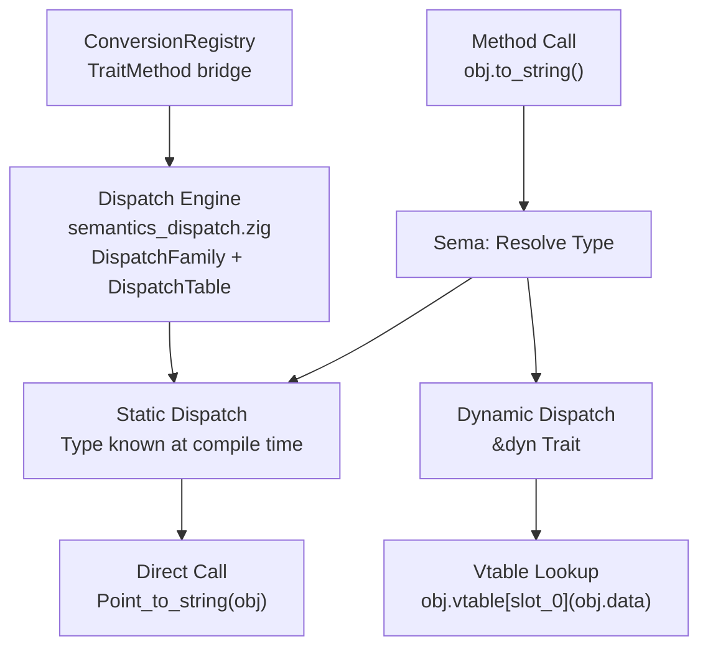

<!--
SPDX-License-Identifier: LUL-1.0
Copyright (c) 2026 Self Sovereign Society Foundation
-->

**Voxis Forge Signal** ⚡

# 🛡️ SPEC-025: Trait/Impl + Dispatch Wiring

**Version:** 1.0.0
**Status:** **DRAFT (Ratification Pending)**
**Doctrinal Alignment:** **Mechanism over Policy + Deterministic Resolution**
**Inspiration:** Rust traits, Elixir protocols, Julia multiple dispatch, Haskell typeclasses
**Depends on:** SPEC-023 (enums for variant-based dispatch tags), SPEC-024 (closures for trait objects)
**Unlocks:** 577-LOC dispatch engine, polymorphism, interface contracts, stdlib abstraction

---

## Abstract

Janus has a 577-line dispatch engine (`semantics_dispatch.zig`) with `DispatchFamily`, `DispatchTable`, and `DispatchResolution` — but nothing feeds it. The AST NodeKinds `.trait_decl` (line 270) and `.impl_decl` (line 271) exist in `astdb/core.zig` but have no parser, no semantic registration, and no codegen path. The `ConversionRegistry` already contains a `TraitMethod` struct (`conversion_registry.zig:16-19`). This spec bridges the gap: parsing trait/impl syntax, registering trait definitions in the semantic graph, wiring impl blocks into the dispatch engine, and emitting both static (direct call) and dynamic (vtable) dispatch.

---

## 1. 🜏 Pipeline Impact

| Stage | File | Change |
|:---|:---|:---|
| Parser | `compiler/libjanus/janus_parser.zig` | Add `parseTraitDeclaration()`, `parseImplBlock()` |
| AST | `compiler/astdb/core.zig` | Wire `.trait_decl` (270), `.impl_decl` (271) |
| Sema | `compiler/libjanus/libjanus_semantic.zig` | Add `TraitDefinitionRegistry`, `ImplBlockStorage` |
| Dispatch | `compiler/libjanus/semantics_dispatch.zig` | Bridge trait methods into `DispatchFamily` |
| Conversion | `compiler/libjanus/conversion_registry.zig` | Extend `TraitMethod` struct as dispatch bridge |
| QTJIR | `compiler/qtjir/graph.zig` | Add 4 OpCodes (see §3) |
| Lowering | `compiler/qtjir/lower.zig` | Add `lowerTraitDecl()`, `lowerImplBlock()`, `lowerTraitMethodCall()` |
| Emission | `compiler/qtjir/llvm_emitter.zig` | Static dispatch (direct call) + dynamic dispatch (vtable lookup) |

---

## 2. ⊢ Syntax + Semantics

### 2.1 Trait Declaration

[TRAIT:2.1.1] A trait declares a set of method signatures that types **MUST** implement.

```janus
trait Printable do
    func to_string(self) -> String
end
```

[TRAIT:2.1.2] Traits **MAY** include default implementations.

```janus
trait Printable do
    func to_string(self) -> String

    func print(self) do
        println(self.to_string())
    end
end
```

[TRAIT:2.1.3] The first parameter of a trait method **MUST** be `self` (receiver).

### 2.2 Impl Block

[TRAIT:2.2.1] An `impl` block provides concrete implementations of a trait for a specific type.

```janus
impl Printable for Point do
    func to_string(self) -> String do
        return "(" + str(self.x) + ", " + str(self.y) + ")"
    end
end
```

[TRAIT:2.2.2] A type **MAY** implement multiple traits.

[TRAIT:2.2.3] An impl block **MUST** provide implementations for all required methods (those without defaults). Missing methods produce a compile error.

### 2.3 Standalone Impl Block

[TRAIT:2.3.1] A standalone `impl` block (no trait) adds methods to a type.

```janus
impl Point do
    func distance(self, other: Point) -> f64 do
        let dx = self.x - other.x
        let dy = self.y - other.y
        return sqrt(dx * dx + dy * dy)
    end
end
```

### 2.4 Dispatch Rules

[TRAIT:2.4.1] **Static Dispatch (Default):** When the concrete type is known at compile time, trait method calls resolve to direct function calls. No vtable overhead.

[TRAIT:2.4.2] **Dynamic Dispatch:** When the type is abstracted behind `&dyn Trait`, calls go through a dispatch table (vtable).

```janus
func print_any(obj: &dyn Printable) do
    obj.to_string()  // dynamic dispatch via vtable
end
```

[TRAIT:2.4.3] **Multiple Dispatch Integration:** Trait methods are registered as `DispatchFamily` entries in `semantics_dispatch.zig`. The existing dispatch engine resolves the correct impl based on type matching.

---

## 3. ⟁ QTJIR OpCodes

New OpCodes:

```
// --- Traits ---
Trait_Method_Call,      // Call trait method: resolve via type + trait + method name
Vtable_Lookup,          // Dynamic dispatch: load fn_ptr from vtable at offset
Vtable_Construct,       // Build vtable struct for a type implementing a trait
Impl_Method_Ref,        // Reference to a specific impl method (for vtable slot)
```

---

## 4. ⟁ Dispatch Architecture



### 4.1 Static Dispatch Path

[TRAIT:4.1.1] The compiler resolves the concrete type at the call site, looks up the `ImplBlock` for `(Type, Trait)`, and emits a direct call to the impl function.

### 4.2 Dynamic Dispatch Path (vtable)

[TRAIT:4.2.1] For `&dyn Trait` parameters, the compiler generates a vtable struct:

```
Vtable_Printable = struct {
    to_string: fn(*opaque) -> String,
    print: fn(*opaque) -> void,
}
```

[TRAIT:4.2.2] At the call site, the compiler emits: load vtable pointer → index into vtable at method slot → indirect call.

### 4.3 Dispatch Engine Integration

[TRAIT:4.3.1] Each trait's methods are registered as a `DispatchFamily` in `semantics_dispatch.zig`.

[TRAIT:4.3.2] Each `impl` block adds entries to the family's `DispatchTable`, keyed by the implementing type.

[TRAIT:4.3.3] The `DispatchResolution` struct already contains `target_function` and `optimization_hint` — static dispatch sets `optimization_hint = .direct_call`, dynamic sets `.vtable_lookup`.

---

## 5. BDD Scenarios

### Scenario TRAIT-001: Trait declaration

**Profile:** `:core` | **Capability:** None

- **Given:** `trait Printable do func to_string(self) -> String end`
- **When:** Parsed and semantic checked
- **Then:** `TraitDefinition` registered with 1 required method signature
- **Invariant:** Trait has no concrete implementation — methods are abstract

### Scenario TRAIT-002: Impl block for struct

**Profile:** `:core` | **Capability:** None

- **Given:** `impl Printable for Point do func to_string(self) -> String do "point" end end`
- **When:** Compiled
- **Then:** `ImplBlock` registered, method added to `DispatchFamily("Printable.to_string")`
- **Invariant:** All required methods implemented

### Scenario TRAIT-003: Missing impl method (compile error)

**Profile:** `:core` | **Capability:** None

- **Given:** Trait with 2 methods, impl block provides only 1
- **When:** Compiled
- **Then:** Compile error: "type `Point` does not implement required method `print` of trait `Printable`"
- **Invariant:** Missing required methods are always caught

### Scenario TRAIT-004: Static dispatch (type known)

**Profile:** `:core` | **Capability:** None

- **Given:** `let p = Point { x: 1, y: 2 }; p.to_string()`
- **When:** Compiled with concrete type `Point`
- **Then:** Direct call emitted to `Point_Printable_to_string` — no vtable
- **Invariant:** Static dispatch has zero indirect-call overhead

### Scenario TRAIT-005: Dynamic dispatch (&dyn Trait)

**Profile:** `:core` | **Capability:** None

- **Given:** `func print_any(obj: &dyn Printable) do obj.to_string() end`
- **When:** Compiled
- **Then:** Vtable lookup emitted — `obj.vtable[0](obj.data)`
- **Invariant:** Dynamic dispatch only when type is erased

### Scenario TRAIT-006: Multiple impls for same trait

**Profile:** `:core` | **Capability:** None

- **Given:** `impl Printable for Point do ... end` and `impl Printable for Circle do ... end`
- **When:** Both compiled
- **Then:** Dispatch engine holds 2 entries in `DispatchFamily("Printable.to_string")`
- **Invariant:** Dispatch resolves correct impl based on receiver type

### Scenario TRAIT-007: Standalone impl (no trait)

**Profile:** `:core` | **Capability:** None

- **Given:** `impl Point do func distance(self, other: Point) -> f64 do ... end end`
- **When:** `p.distance(q)` called
- **Then:** Direct call to `Point_distance` — registered as method on `Point`
- **Invariant:** Standalone impl methods are type-scoped, not trait-scoped

### Scenario TRAIT-008: Default trait method

**Profile:** `:core` | **Capability:** None

- **Given:** Trait with default `print()` method, impl does NOT override it
- **When:** `obj.print()` called
- **Then:** Default implementation used
- **Invariant:** Default methods provide fallback without requiring explicit impl

---

## 6. Semantic Graph Extensions

### 6.1 TraitDefinitionRegistry

```
TraitDefinition = struct {
    name: []const u8,
    methods: []TraitMethodSignature,
    default_impls: []?FuncDecl,
}

TraitMethodSignature = struct {
    name: []const u8,
    params: []TypeId,
    return_type: TypeId,
    has_default: bool,
}
```

### 6.2 ImplBlockStorage

```
ImplBlock = struct {
    trait_name: ?[]const u8,       // null for standalone impl
    implementing_type: TypeId,
    methods: []FuncDecl,
}
```

### 6.3 Critical Type Bridge

[TRAIT:6.3.1] `FuncDecl` currently uses `[]const u8` for types, not `TypeId`. The dispatch engine needs `TypeId` for resolution. The bridge **MUST** convert string-based types in `FuncDecl` to `TypeId` during semantic analysis.

---

## 7. Implementation Checklist

- [ ] **Parser:** `parseTraitDeclaration()` — parse `trait Name do methods end`
- [ ] **Parser:** `parseImplBlock()` — parse `impl Trait for Type do methods end` and `impl Type do methods end`
- [ ] **AST:** Wire `.trait_decl` and `.impl_decl` NodeKinds through construction
- [ ] **Sema:** `TraitDefinitionRegistry` — store trait definitions with method signatures
- [ ] **Sema:** `ImplBlockStorage` — store impl blocks indexed by `(Type, Trait)` pair
- [ ] **Sema:** Type bridge — convert `FuncDecl` string types to `TypeId`
- [ ] **Sema:** Validate impl completeness — all required methods present
- [ ] **Dispatch:** Register trait methods as `DispatchFamily` entries in `semantics_dispatch.zig`
- [ ] **Dispatch:** Register impl methods as `DispatchTable` entries
- [ ] **QTJIR:** Add 4 OpCodes to `graph.zig`
- [ ] **Lowering:** `lowerTraitDecl()` — register trait (no code emitted)
- [ ] **Lowering:** `lowerImplBlock()` — lower each method, register in dispatch
- [ ] **Lowering:** `lowerTraitMethodCall()` — static or dynamic based on type knowledge
- [ ] **Emission:** Static dispatch — direct call emission
- [ ] **Emission:** Dynamic dispatch — vtable struct generation + indirect call
- [ ] **Tests:** One integration test per BDD scenario (TRAIT-001 through TRAIT-008)

---

## 8. Test Traceability

| Scenario ID | Test Block | Pipeline Stages |
|:---|:---|:---|
| TRAIT-001 | `test "TRAIT-001: trait declaration"` | Parser → Sema (registry) |
| TRAIT-002 | `test "TRAIT-002: impl block for struct"` | Parser → Sema → Dispatch |
| TRAIT-003 | `test "TRAIT-003: missing impl method"` | Parser → Sema (error) |
| TRAIT-004 | `test "TRAIT-004: static dispatch"` | Sema → Lower → LLVM (direct call) |
| TRAIT-005 | `test "TRAIT-005: dynamic dispatch"` | Sema → Lower → LLVM (vtable) |
| TRAIT-006 | `test "TRAIT-006: multiple impls"` | Sema → Dispatch → Lower |
| TRAIT-007 | `test "TRAIT-007: standalone impl"` | Parser → Sema → Lower → LLVM |
| TRAIT-008 | `test "TRAIT-008: default trait method"` | Sema → Lower → LLVM → Exec |

---

## 9. Orders

1. **Commit:** Save to `specs/SPEC-025-trait-impl-dispatch.md`.
2. **Implementation:**
   * **Phase 1:** Parser — `parseTraitDeclaration()` and `parseImplBlock()` in `janus_parser.zig`.
   * **Phase 2:** Sema — `TraitDefinitionRegistry`, `ImplBlockStorage`, type bridge for `FuncDecl`.
   * **Phase 3:** Dispatch Bridge — Wire traits into `DispatchFamily` via `ConversionRegistry.TraitMethod` (`conversion_registry.zig:16-19`).
   * **Phase 4:** Lowering — Static and dynamic dispatch paths in `lower.zig`.
   * **Phase 5:** Emission — Direct calls + vtable struct generation in `llvm_emitter.zig`.
   * **Phase 6:** Tests — One integration test per scenario.

**Traits are the contract. Impls are the fulfillment. Dispatch is the arbiter.** Without this triad, Janus has 577 lines of dispatch infrastructure collecting dust.

---

**Ratified:** 2026-02-22
**Authority:** Markus Maiwald + Voxis Forge
**Status:** DRAFT (Ratification Pending)
