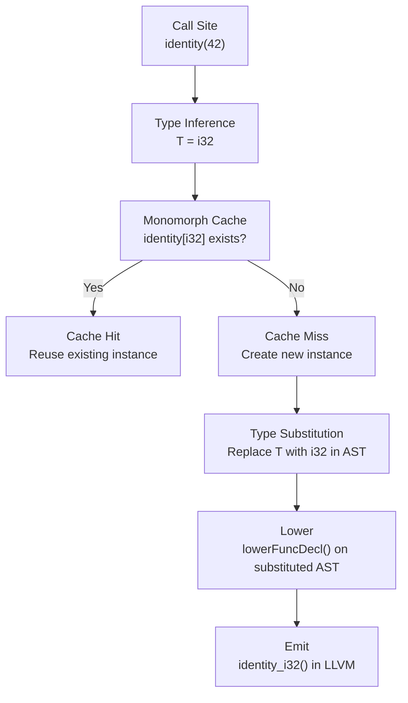

<!--
SPDX-License-Identifier: LUL-1.0
Copyright (c) 2026 Self Sovereign Society Foundation
-->

**Voxis Forge Signal** ⚡

# 🛡️ SPEC-026: Generics — Type Parameters + Monomorphization

**Version:** 1.0.0
**Status:** **DRAFT (Ratification Pending)**
**Doctrinal Alignment:** **Syntactic Honesty + Zero Hidden Cost**
**Inspiration:** Rust generics, C++ templates, Zig comptime, ML parametric polymorphism
**Depends on:** SPEC-025 (traits for generic bounds: `T: Printable`)
**Unlocks:** `Vec[T]`, `HashMap[K, V]`, self-hosting stdlib in Janus

---

## Abstract

Generics are the final structural prerequisite for a self-hosting stdlib. The AST has `.type_param` at `astdb/core.zig:359` as a placeholder, but the parser has no `parseGenericParams()`, the `Type` union (`libjanus_semantic.zig:13-48`) has no generic representation, and no monomorphization pipeline exists. This spec defines generics via monomorphization — each instantiation produces a distinct compiled type/function, honoring Janus's "Zero Hidden Cost" doctrine.

---

## 1. 🜏 Pipeline Impact

| Stage | File | Change |
|:---|:---|:---|
| Parser | `compiler/libjanus/janus_parser.zig` | Add `parseGenericParams()`, `parseGenericArgs()` |
| AST | `compiler/astdb/core.zig` | Wire `.type_param` (359), add `.generic_instantiation` |
| Sema | `compiler/libjanus/libjanus_semantic.zig` | Add `Type.Generic`, `TypeParamBinding`, `MonomorphCache` |
| Trait Integration | `compiler/libjanus/semantics_dispatch.zig` | Generic bounds checked against `TraitDefinitionRegistry` |
| QTJIR | `compiler/qtjir/graph.zig` | No new OpCodes — monomorphized instances use existing ops |
| Lowering | `compiler/qtjir/lower.zig` | Per-instance lowering with type substitution |
| Emission | `compiler/qtjir/llvm_emitter.zig` | Per-instance emission with mangled names |

---

## 2. ⊢ Syntax + Semantics

### 2.1 Generic Function

[GEN:2.1.1] Type parameters are declared in square brackets after the function name.

```janus
func identity[T](x: T) -> T do
    return x
end
```

[GEN:2.1.2] Type arguments **MAY** be inferred at the call site.

```janus
let a = identity(42)        // T inferred as i32
let b = identity("hello")   // T inferred as String
```

[GEN:2.1.3] Type arguments **MAY** be explicit.

```janus
let a = identity[i32](42)
```

### 2.2 Generic Struct

[GEN:2.2.1] Structs **MAY** have type parameters.

```janus
struct Pair[A, B] {
    first: A,
    second: B,
}
```

[GEN:2.2.2] Construction requires type arguments (inferred or explicit).

```janus
let p = Pair { first: 1, second: "hello" }   // A=i32, B=String inferred
let q = Pair[f64, bool] { first: 3.14, second: true }
```

### 2.3 Generic Trait Bounds

[GEN:2.3.1] Type parameters **MAY** be constrained by traits (requires SPEC-025).

```janus
func print_it[T: Printable](x: T) do
    x.to_string()
end
```

[GEN:2.3.2] Multiple bounds use `+` syntax.

```janus
func process[T: Printable + Comparable](x: T) do ... end
```

[GEN:2.3.3] Unbounded type parameters accept any type (equivalent to `T: Any`).

### 2.4 Monomorphization

[GEN:2.4.1] The compiler **MUST** monomorphize all generic instantiations. Each unique set of type arguments produces a distinct compiled function or struct.

[GEN:2.4.2] Monomorphized instances are cached — `identity[i32]` called twice produces only one compiled function.

[GEN:2.4.3] Monomorphized names are mangled: `identity_i32`, `Pair_i32_String`.

---

## 3. ⟁ Monomorphization Pipeline



---

## 4. BDD Scenarios

### Scenario GEN-001: Generic function — inferred type

**Profile:** `:core` | **Capability:** None

- **Given:** `func identity[T](x: T) -> T do return x end`
- **When:** `identity(42)` and `identity("hello")` called
- **Then:** Two monomorphized instances emitted: `identity_i32` and `identity_String`
- **Invariant:** Each instance is a standalone function with no indirection

### Scenario GEN-002: Generic function — explicit type

**Profile:** `:core` | **Capability:** None

- **Given:** `func identity[T](x: T) -> T do return x end`
- **When:** `identity[i32](42)` called
- **Then:** `identity_i32` emitted
- **Invariant:** Explicit type argument overrides inference

### Scenario GEN-003: Generic struct

**Profile:** `:core` | **Capability:** None

- **Given:** `struct Pair[A, B] { first: A, second: B }`
- **When:** `Pair[i32, String] { first: 1, second: "x" }` constructed
- **Then:** Monomorphized struct `Pair_i32_String` emitted with layout `{ i32, String }`
- **Invariant:** Struct size matches concrete field types

### Scenario GEN-004: Trait bound on generic

**Profile:** `:core` | **Capability:** None

- **Given:** `func print_it[T: Printable](x: T) do x.to_string() end`
- **When:** Called with type that does NOT implement `Printable`
- **Then:** Compile error: "type `i32` does not satisfy bound `Printable`"
- **Invariant:** Trait bounds checked at instantiation site

### Scenario GEN-005: Trait bound satisfied

**Profile:** `:core` | **Capability:** None

- **Given:** `func print_it[T: Printable](x: T) do x.to_string() end` + `impl Printable for Point`
- **When:** `print_it(Point { x: 1, y: 2 })` called
- **Then:** `print_it_Point` emitted with direct call to `Point_Printable_to_string`
- **Invariant:** Trait bound satisfied, monomorphized with static dispatch

### Scenario GEN-006: Monomorphization cache

**Profile:** `:core` | **Capability:** None

- **Given:** `identity[i32](1)` called in two different functions
- **When:** Compiled
- **Then:** Only one `identity_i32` instance emitted
- **Invariant:** Cache prevents duplicate monomorphization

### Scenario GEN-007: Multiple type parameters

**Profile:** `:core` | **Capability:** None

- **Given:** `func swap[A, B](pair: Pair[A, B]) -> Pair[B, A] do return Pair { first: pair.second, second: pair.first } end`
- **When:** `swap(Pair { first: 1, second: "hi" })` called
- **Then:** `swap_i32_String` emitted returning `Pair_String_i32`
- **Invariant:** Multi-parameter generics monomorphize all type arguments

---

## 5. Type System Extensions

### 5.1 Type Union Additions

Add to `Type` union in `libjanus_semantic.zig`:

```
Type.Generic = struct {
    name: []const u8,           // "T", "A", "B"
    bound: ?TraitRef,           // null = unbounded, else trait bound
    id: TypeParamId,            // unique within the generic context
}

Type.GenericInstance = struct {
    base: TypeId,               // the generic definition (e.g., Pair)
    args: []TypeId,             // concrete type arguments [i32, String]
}
```

### 5.2 MonomorphCache

```
MonomorphCache = HashMap(MonomorphKey, TypeId)

MonomorphKey = struct {
    generic_def: TypeId,
    type_args: []TypeId,
}
```

### 5.3 Type Substitution Engine

[GEN:5.3.1] Given a generic AST and concrete type arguments, produce a substituted AST where all `Type.Generic` nodes are replaced with concrete types.

[GEN:5.3.2] Substitution is recursive — `Pair[T, Vec[T]]` with `T=i32` yields `Pair[i32, Vec[i32]]`.

---

## 6. Implementation Checklist

- [ ] **Parser:** `parseGenericParams()` — parse `[T]`, `[A, B]`, `[T: Trait]`
- [ ] **Parser:** `parseGenericArgs()` — parse `[i32]`, `[i32, String]` at call/construction sites
- [ ] **AST:** Wire `.type_param` (359) and add `.generic_instantiation` NodeKind
- [ ] **Sema:** Add `Type.Generic` and `Type.GenericInstance` to `Type` union
- [ ] **Sema:** Type inference engine — infer type arguments from call site
- [ ] **Sema:** Trait bound checking — verify type arguments satisfy declared bounds
- [ ] **Sema:** Type substitution engine — replace `Type.Generic` with concrete types
- [ ] **Sema:** `MonomorphCache` — cache and deduplicate instantiations
- [ ] **Lowering:** Per-instance lowering with substituted AST
- [ ] **Emission:** Per-instance emission with mangled names (`identity_i32`)
- [ ] **Tests:** One integration test per BDD scenario (GEN-001 through GEN-007)

---

## 7. Test Traceability

| Scenario ID | Test Block | Pipeline Stages |
|:---|:---|:---|
| GEN-001 | `test "GEN-001: generic function inferred"` | Parser → Sema (infer) → Monomorph → Lower → LLVM |
| GEN-002 | `test "GEN-002: generic function explicit"` | Parser → Sema → Monomorph → Lower → LLVM |
| GEN-003 | `test "GEN-003: generic struct"` | Parser → Sema → Monomorph → Lower → LLVM |
| GEN-004 | `test "GEN-004: trait bound violation"` | Parser → Sema (error) |
| GEN-005 | `test "GEN-005: trait bound satisfied"` | Parser → Sema → Dispatch → Monomorph → LLVM |
| GEN-006 | `test "GEN-006: monomorph cache"` | Sema → Monomorph (cache hit) → LLVM |
| GEN-007 | `test "GEN-007: multiple type params"` | Parser → Sema → Monomorph → Lower → LLVM |

---

## 8. Orders

1. **Commit:** Save to `specs/SPEC-026-generics.md`.
2. **Implementation:**
   * **Phase 1:** Parser — `parseGenericParams()` and `parseGenericArgs()` in `janus_parser.zig`.
   * **Phase 2:** Type System — `Type.Generic`, `Type.GenericInstance`, `MonomorphCache` in `libjanus_semantic.zig`.
   * **Phase 3:** Sema — Type inference, trait bound checking, type substitution engine.
   * **Phase 4:** Monomorphization — Instance generation, caching, name mangling.
   * **Phase 5:** Lowering/Emission — Per-instance pipeline through existing infrastructure.
   * **Phase 6:** Tests — One integration test per scenario.

**Generics are the multiplication operator of the type system.** One definition produces infinite concrete instances. Without them, Janus writes the same function for every type — a compiler doing grunt work that should be done by the compiler.

---

**Ratified:** 2026-02-22
**Authority:** Markus Maiwald + Voxis Forge
**Status:** DRAFT (Ratification Pending)
