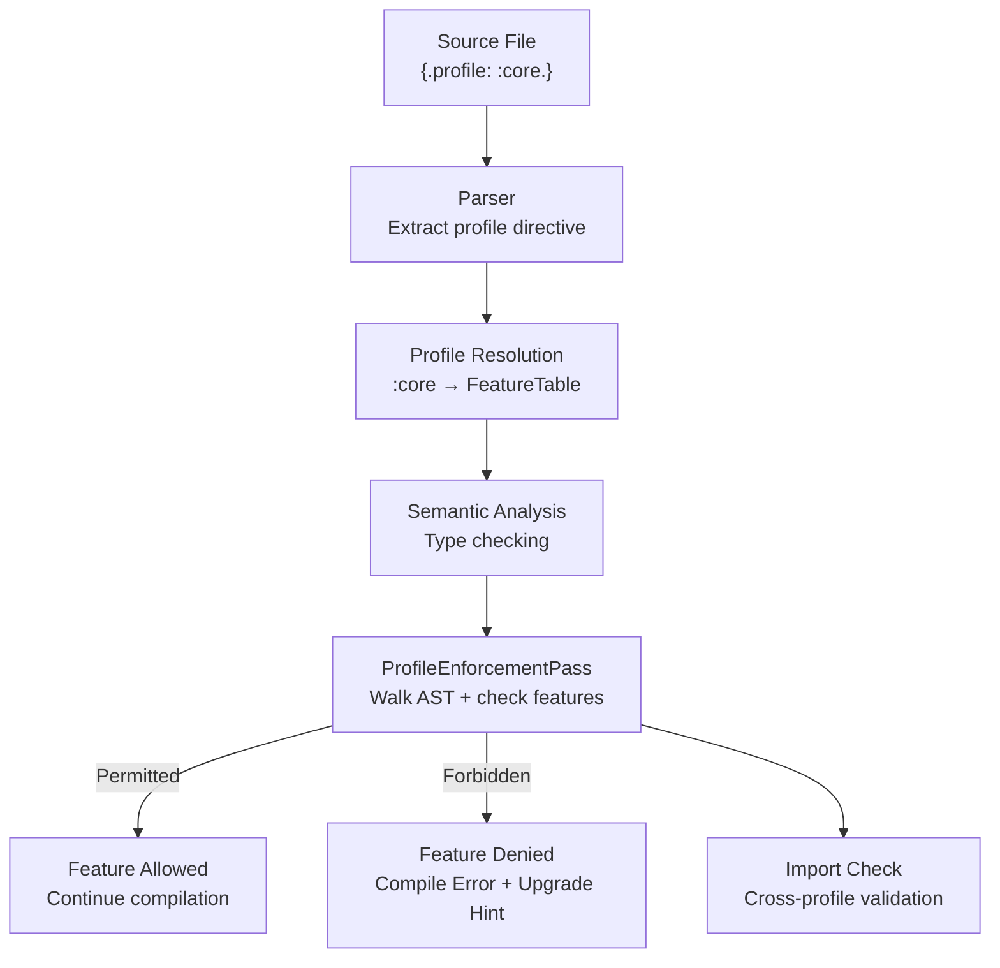

<!--
SPDX-License-Identifier: LUL-1.0
Copyright (c) 2026 Self Sovereign Society Foundation
-->

**Voxis Forge Signal** ⚡

# 🛡️ SPEC-027: Profile Enforcement — Compiler-Gated Feature Access

**Version:** 1.0.0
**Status:** **DRAFT (Ratification Pending)**
**Doctrinal Alignment:** **The Time Machine (SPEC-002) + Mechanisms over Policy**
**Inspiration:** Rust editions, Zig safety modes, Janus Profile Matrix (SPEC-002)
**Depends on:** SPEC-023 (enums), SPEC-024 (closures), SPEC-025 (traits), SPEC-026 (generics)
**Unlocks:** Profile system as compiler constraint, not documentation

---

## Abstract

The Janus Profile System (SPEC-002) defines 6 capability tiers — `:core`, `:script`, `:service`, `:cluster`, `:compute`, `:sovereign`. Profile names are already parsed by `ProfileParser` (`src/profile_parser.zig:13-161`) with feature detection (`analyzeProfileFeatures` at line 48) and violation tracking. But the compiler does not enforce it — all features are available in all profiles. This spec defines the enforcement pass: a semantic analysis stage that walks the AST, checks each construct against the active profile's feature table, and emits compile errors with profile upgrade suggestions.

---

## 1. 🜏 Pipeline Impact

| Stage | File | Change |
|:---|:---|:---|
| Profile Parsing | `src/profile_parser.zig` | Already exists (lines 13-161) — wire into compiler pipeline |
| Sema | `compiler/libjanus/libjanus_semantic.zig` | Add `ProfileEnforcementPass` |
| Feature Tables | New: `compiler/libjanus/profile_features.zig` | Static profile → feature mapping |
| Error Diagnostics | `compiler/libjanus/` (errors) | Profile-aware error messages with upgrade hints |
| Import Gating | `compiler/libjanus/` (imports) | Cross-profile import validation |

---

## 2. ⊢ Profile Feature Matrix

Per SPEC-002 (`specs/SPEC-002-profiles.md`):

| Feature | `:core` | `:script` | `:service` | `:cluster` | `:compute` | `:sovereign` |
|:---|:---:|:---:|:---:|:---:|:---:|:---:|
| `func`, `if`, `while`, `for`, `match` | ⊢ | ⊢ | ⊢ | ⊢ | ⊢ | ⊢ |
| `struct`, `enum`, `union` | ⊢ | ⊢ | ⊢ | ⊢ | ⊢ | ⊢ |
| `trait`, `impl` | ⊢ | ⊢ | ⊢ | ⊢ | ⊢ | ⊢ |
| Closures / fn literals | ⊢ | ⊢ | ⊢ | ⊢ | ∅ | ⊢ |
| Implicit allocation | ∅ | ⊢ | ∅ | ∅ | ∅ | ⊢ |
| `async` / `await` | ∅ | ∅ | ⊢ | ⊢ | ∅ | ⊢ |
| `spawn` / `send` / `receive` | ∅ | ∅ | ∅ | ⊢ | ∅ | ⊢ |
| `nursery` / structured concurrency | ∅ | ∅ | ⊢ | ⊢ | ∅ | ⊢ |
| `kernel` / tensor intrinsics | ∅ | ∅ | ∅ | ∅ | ⊢ | ⊢ |
| Raw pointers (`*T`) | ∅ | ∅ | ∅ | ∅ | ∅ | ⊢ |
| `unsafe` blocks | ∅ | ∅ | ∅ | ∅ | ∅ | ⊢ |
| Metaprogramming | ∅ | ⊢ | ∅ | ∅ | ∅ | ⊢ |
| Dynamic typing (`Any`) | ∅ | ⊢ | ∅ | ∅ | ∅ | ∅ |

**Legend:** ⊢ = Permitted · ∅ = Forbidden

[PROF:2.1.1] Feature tables are **static** and **compile-time only**. No runtime cost.

---

## 3. ⟁ Enforcement Architecture


```mermaid
flowchart TD
    SRC["Source File<br/>{.profile: :core.}"]
    PARSE["Parser<br/>Extract profile directive"]
    PROF["Profile Resolution<br/>:core → FeatureTable"]
    SEMA["Semantic Analysis<br/>Type checking"]
    ENFORCE["ProfileEnforcementPass<br/>Walk AST + check features"]

    ALLOW["Feature Allowed<br/>Continue compilation"]
    DENY["Feature Denied<br/>Compile Error + Upgrade Hint"]

    IMPORT["Import Check<br/>Cross-profile validation"]

    SRC --> PARSE --> PROF --> SEMA --> ENFORCE
    ENFORCE -->|Permitted| ALLOW
    ENFORCE -->|Forbidden| DENY
    ENFORCE --> IMPORT
```

---

## 4. ⊢ Enforcement Rules

### 4.1 Profile Declaration

[PROF:4.1.1] The profile directive `{.profile: name.}` **MUST** be the first declaration in a file (per SPEC-002).

[PROF:4.1.2] If no profile directive is present, the file defaults to `:core`.

[PROF:4.1.3] The `ProfileParser` (`src/profile_parser.zig`) already handles parsing — the enforcement pass reads the resolved profile.

### 4.2 Feature Gating

[PROF:4.2.1] The enforcement pass walks every AST node. For each node, it checks:
1. Is this construct in the active profile's feature table?
2. If not, emit a compile error with the feature name and the minimum required profile.

[PROF:4.2.2] Error format: `"<feature> requires <min_profile> profile or higher (current: <active_profile>)"`

### 4.3 Import Gating

[PROF:4.3.1] A strict-mode module (`:core`, `:service`) **CANNOT** import a fluid-mode module (`:script`). This is the Contamination Rule from SPEC-002 `[PROF:3.1.2]`.

[PROF:4.3.2] A lower-capability module **CANNOT** import a higher-capability module. `:core` cannot import `:service` modules.

[PROF:4.3.3] Import validation occurs during module resolution, before semantic analysis.

### 4.4 Upgrade Suggestions

[PROF:4.4.1] The `ProfileParser` already contains an upgrade suggestion engine (`src/profile_parser.zig:212-230`). Wire this into compile error diagnostics.

---

## 5. BDD Scenarios

### Scenario PROF-001: :core rejects async

**Profile:** `:core` | **Capability:** None

- **Given:** File with `{.profile: :core.}` containing `async func foo() do ... end`
- **When:** Compiled
- **Then:** Error: "async functions require `:service` profile or higher (current: `:core`)"
- **Invariant:** `:core` has zero concurrency features

### Scenario PROF-002: :core allows basic features

**Profile:** `:core` | **Capability:** None

- **Given:** File with `{.profile: :core.}` containing `func`, `if`, `while`, `match`, `struct`, `enum`
- **When:** Compiled
- **Then:** All compile successfully with no profile errors
- **Invariant:** `:core` permits all fundamental constructs

### Scenario PROF-003: :service allows concurrency

**Profile:** `:service` | **Capability:** None

- **Given:** File with `{.profile: :service.}` containing nursery/spawn/await
- **When:** Compiled
- **Then:** Compiles successfully
- **Invariant:** `:service` enables structured concurrency

### Scenario PROF-004: No profile defaults to :core

**Profile:** (none) | **Capability:** None

- **Given:** File with no profile declaration, containing `async func foo() do ... end`
- **When:** Compiled
- **Then:** Error: "async functions require `:service` profile or higher (current: `:core`)"
- **Invariant:** Missing profile directive = `:core`

### Scenario PROF-005: Profile mismatch on import

**Profile:** `:core` | **Capability:** None

- **Given:** `:core` module importing a `:service` module
- **When:** Compiled
- **Then:** Error: "cannot import `:service` module from `:core` context — capability escalation forbidden"
- **Invariant:** Lower profiles cannot import higher profiles (Contamination Rule)

### Scenario PROF-006: :script cannot be published

**Profile:** `:script` | **Capability:** None

- **Given:** `:script` module used as library dependency
- **When:** `janus publish` invoked
- **Then:** Error: "`:script` modules cannot be published — lower to `:core` or `:service` first"
- **Invariant:** `:script` is ephemeral, not distributable (SPEC-002 `[PROF:2.2.5]`)

### Scenario PROF-007: :sovereign allows everything

**Profile:** `:sovereign` | **Capability:** All

- **Given:** File with `{.profile: :sovereign.}` containing raw pointers, unsafe blocks, async, spawn
- **When:** Compiled
- **Then:** All compile successfully
- **Invariant:** `:sovereign` is the unrestricted profile

### Scenario PROF-008: :compute restricts branching

**Profile:** `:compute` | **Capability:** Kernel

- **Given:** File with `{.profile: :compute.}` containing non-uniform `if/else`
- **When:** Compiled
- **Then:** Warning or error: "non-uniform branching restricted in `:compute` profile"
- **Invariant:** `:compute` enforces SIMD-compatible control flow (SPEC-002 `[PROF:2.5.3]`)

### Scenario PROF-009: Upgrade suggestion in error

**Profile:** `:core` | **Capability:** None

- **Given:** `:core` file using `spawn`
- **When:** Compiled
- **Then:** Error includes: "hint: upgrade to `:cluster` to use actor primitives"
- **Invariant:** Error messages always suggest the minimum required profile

---

## 6. Feature Table Implementation

### 6.1 Static Feature Table

```
ProfileFeatureTable = struct {
    allowed_node_kinds: []NodeKind,
    allowed_opcodes: []OpCode,
    allowed_keywords: []Keyword,
}

const CORE_FEATURES = ProfileFeatureTable {
    .allowed_node_kinds = &[_]NodeKind{
        .func_decl, .struct_decl, .enum_decl, .union_decl,
        .trait_decl, .impl_decl, .var_decl, .const_decl,
        .if_expr, .while_expr, .for_expr, .match_expr,
        .closure_literal, .error_decl,
    },
    .allowed_opcodes = &[_]OpCode{ ... },  // all non-concurrency ops
    .allowed_keywords = &[_]Keyword{
        .func, .let, .var, .const, .if_, .else_, .while_,
        .for_, .match, .do_, .end, .return_, .struct_,
        .enum_, .union_, .trait_, .impl_, .using,
    },
};
```

### 6.2 Profile Hierarchy

```
:core < :service < :cluster < :sovereign
:core < :script (fluid, non-publishable)
:core < :compute (parallel, restricted branching)
```

[PROF:6.2.1] Higher profiles include all features of lower profiles (except `:script` and `:compute` which are lateral).

---

## 7. Implementation Checklist

- [ ] **Feature Tables:** Create `profile_features.zig` with static `ProfileFeatureTable` per profile
- [ ] **Sema Pass:** `ProfileEnforcementPass` — walk AST, check each node against active profile
- [ ] **Import Gating:** Cross-profile validation during module resolution
- [ ] **Error Diagnostics:** Profile-aware error messages with upgrade hints
- [ ] **Wire:** Connect `ProfileParser` (`src/profile_parser.zig`) output to enforcement pass
- [ ] **Default Profile:** Apply `:core` when no directive present
- [ ] **Publish Gating:** Reject `:script` modules from `janus publish`
- [ ] **Tests:** One integration test per BDD scenario (PROF-001 through PROF-009)

---

## 8. Test Traceability

| Scenario ID | Test Block | Pipeline Stages |
|:---|:---|:---|
| PROF-001 | `test "PROF-001: core rejects async"` | Parser → Profile → Enforce (error) |
| PROF-002 | `test "PROF-002: core allows basics"` | Parser → Profile → Enforce (pass) |
| PROF-003 | `test "PROF-003: service allows concurrency"` | Parser → Profile → Enforce (pass) |
| PROF-004 | `test "PROF-004: no profile defaults to core"` | Parser → Profile (default) → Enforce (error) |
| PROF-005 | `test "PROF-005: profile mismatch on import"` | Parser → Import → Enforce (error) |
| PROF-006 | `test "PROF-006: script cannot be published"` | Publish → Enforce (error) |
| PROF-007 | `test "PROF-007: sovereign allows everything"` | Parser → Profile → Enforce (pass) |
| PROF-008 | `test "PROF-008: compute restricts branching"` | Parser → Profile → Enforce (warn/error) |
| PROF-009 | `test "PROF-009: upgrade suggestion"` | Parser → Profile → Enforce (error + hint) |

---

## 9. Orders

1. **Commit:** Save to `specs/SPEC-027-profile-enforcement.md`.
2. **Implementation:**
   * **Phase 1:** Feature Tables — Static `ProfileFeatureTable` per profile in `profile_features.zig`.
   * **Phase 2:** Enforcement Pass — `ProfileEnforcementPass` in sema, walking AST against feature table.
   * **Phase 3:** Import Gating — Cross-profile validation with Contamination Rule.
   * **Phase 4:** Diagnostics — Error messages with upgrade suggestions (wire `profile_parser.zig:212-230`).
   * **Phase 5:** Tests — One integration test per scenario.

**Profiles without enforcement are suggestions. Suggestions without consequences are decoration.** We make the profile system a constitutional law of the compiler, not a comment at the top of the file.

---

**Ratified:** 2026-02-22
**Authority:** Markus Maiwald + Voxis Forge
**Status:** DRAFT (Ratification Pending)
