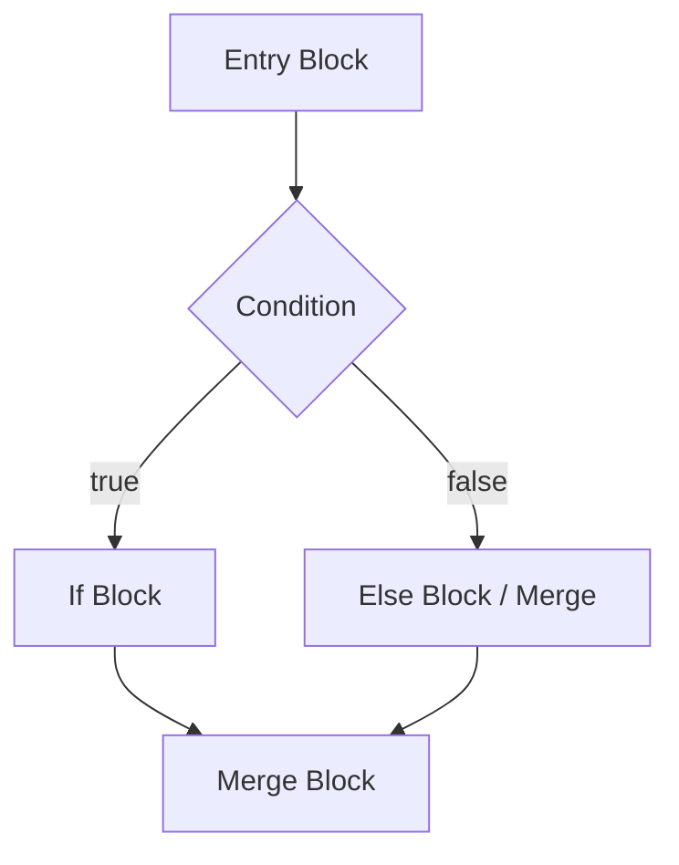

# SPEC-conditionals: Conditional Statements (if/else)

**Status:** DRAFT  
**Authority:** Voxis Forge  
**Profile:** :core  

## 1. Introduction

Conditional statements allow the execution of different code paths based on a boolean condition. In Janus, this is primarily achieved through the `if` and `else` keywords. [COND-01]

## 2. Syntax

The syntax for a conditional statement is: [COND-02]

```janus
if condition {
    // true path
} else {
    // false path (optional)
}
```

## 3. Semantics

### 3.1 Condition [COND-03]
The `condition` MUST evaluate to a boolean type. In the `:core` profile, implicit conversions to boolean are NOT allowed. [LEG-COND-01]

### 3.2 True Branch [COND-04]
If the condition evaluates to `true`, the block associated with the `if` statement is executed. [SEM-COND-01]

### 3.3 False Branch [COND-05]
If the condition evaluates to `false` and an `else` block is present, the `else` block is executed. If no `else` block is present, execution continues after the `if` statement. [SEM-COND-02]

### 3.4 Scoping [COND-06]
Blocks associated with `if` and `else` statements define new lexical scopes. [SEM-COND-03]

## 4. IR Generation (QTJIR)

### 4.1 Branching [COND-07]
The IR generator must produce a `ConditionalBranch` terminator that targets a `true_block` and a `false_block` (or the continuation block). [IR-COND-01]

### 4.2 Labels [COND-08]
Appropriate labels MUST be generated for the entry of the `true_block`, `false_block`, and the `merge_block`. [IR-COND-02]

## 5. Acceptance Criteria (AC-BDD)

### Scenario ID: COND-AC-01: Basic If Statement
**Profile:** :core | **Capability:** none
- **Given:** A valid Janus source with a single `if` statement without `else`.
- **When:** The compiler generates IR for the function.
- **Then:** The IR contains a `ConditionalBranch` where:
    - The `true_block` contains the instructions within the `if` block.
    - The `false_block` points to the `merge_block` (continuation).
- **Invariant:** Linear control flow is preserved through the merge block.

### Scenario ID: COND-AC-02: If-Else Statement
**Profile:** :core | **Capability:** none
- **Given:** A valid Janus source with an `if-else` statement.
- **When:** The compiler generates IR for the function.
- **Then:** The IR contains a `ConditionalBranch` where:
    - The `true_block` contains the instructions within the `if` block.
    - The `false_block` contains the instructions within the `else` block.
    - Both blocks jump to the same `merge_block`.

### Scenario ID: COND-AC-03: Nested If Statements
**Profile:** :core | **Capability:** none
- **Given:** A valid Janus source with an `if` statement inside another `if` statement.
- **When:** The compiler generates IR.
- **Then:** The IR correctly nests the basic blocks with appropriate labels and jumps.

---

## 6. Visualization


