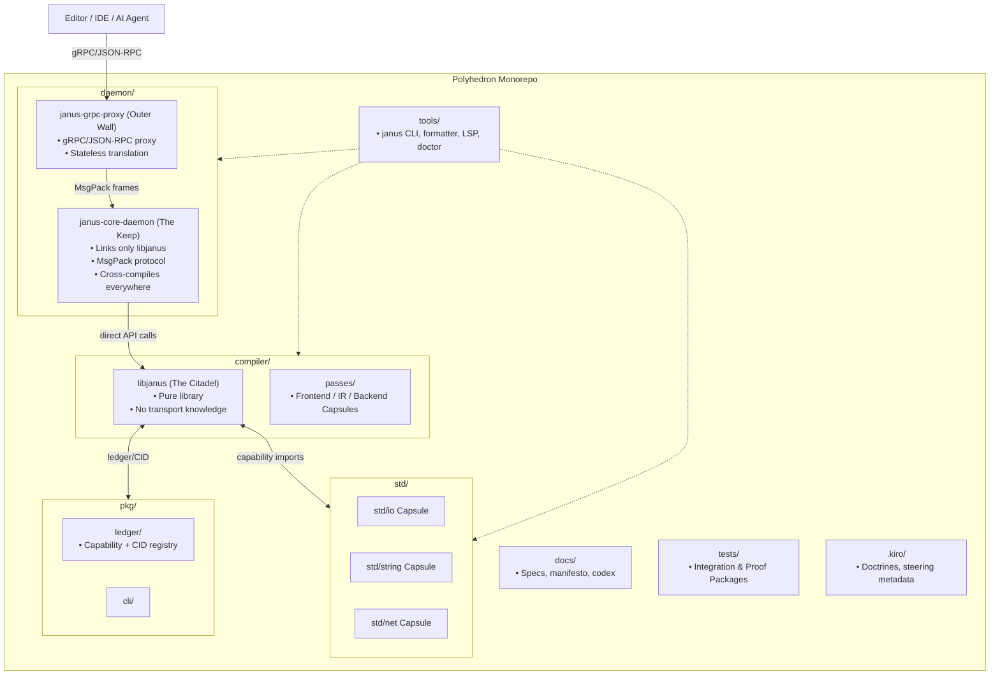

<!--
SPDX-License-Identifier: LUL-1.0
Copyright (c) 2026 Self Sovereign Society Foundation
-->


------

# SPEC: Repository Architecture — Polyhedron & Capsules

**Status:** Draft
 **Author:** Core Team
 **Date:** 2025-09-23
 **Version:** 0.1.0
 **Epic:** Janus Infrastructure

------

## 1. Purpose

The Janus repository is not just a container of code.
 It is a **mirror of the ecosystem**: compiler, standard library, package ledger, tools, AI interfaces.

The repo must be navigable both by **human developers** and **AI agents**, and enforce the doctrines of **Capabilities, Ledger discipline, and Determinism**. It ties together the **Polyhedron Monorepo**, **Capsules**, and the **Citadel/libjanus binary message buffer architecture**. This way, humans and AI agents can navigate the repo like a semantic map, while binaries communicate deterministically.

------

## 2. Core Paradigm

### 2.1 Polyhedron Monorepo

- One repo, structured into **facets** (domains).
- Each facet is **self-sovereign** but participates in the global ledger.
- No wild cross-imports: all dependencies are expressed via **Capability Imports**.

### 2.2 Semantic Capsule Architecture

- **Capsule = Isolated Unit** with declared API and Capability manifest.
- All code, from compiler modules to stdlib functions, lives in Capsules.
- Communication across capsules is explicit: via **declared Ports**, never ambient state.
- This gives:
  - **Human readability** (clear modular docs)
  - **AI navigability** (semantic graph, ASTDB integration)
  - **Upgrade safety** (Ledger pins versions via CIDs)

### 2.3 Compositional Everywhere

- UI, Logic, Data, and Tools all follow the Capsule pattern.
- Standard library modules (`std/io`, `std/net`) are Capsules.
- Compiler stages (`frontend`, `backend`, `passes`) are Capsules.
- Even the daemons and proxies (Citadel Architecture) are Capsules.

------

## 3. Repo Structure

```plaintext
janus/
├── compiler/               # Compiler core
│   ├── libjanus/           # Pure compiler as library (The Citadel)
│   ├── passes/             # Frontend, IR, backend passes (Capsules)
│   └── astdb/				# revolutionary AST-DB system
│   └── tests-compiler/
│
├── daemon/                 # The Keep + Outer Wall
│   ├── janus-core-daemon/  # Keep: libjanus + MessagePack protocol
│   ├── janus-grpc-proxy/   # Outer Wall: gRPC proxy (stateless)
│   └── tests-daemon/
│
├── std/                    # Standard library capsules
│   ├── io/
│   ├── string/
│   ├── net/
│   └── collections/
│   └── tests-std/
│
├── pkg/                    # Package Ledger + CLI + hinge tool
│   ├── ledger/             # Capability + CID registry
│   └── cli/
│   └── tests-pkg/
│
├── tools/                  # CLI, formatter, LSP bridge, janus doctor
│   └── tests-tools/
│
├── docs/                   # Specs, manifesto, RFCs
│   ├── specs/
│   ├── manifesto.md
│   └── codex.md
│   └── handbook/
│
├── tests-build/            # Integration + Proof Packages
│
└── .agents/                # INTERNAL/PRIVATE OPERATIONAL DOCS, like Doctrines, codex, steering metadata for agents
```


------

## 4. Binary Message Buffers

The communication between components is **binary, deterministic, and ledger-auditable**.

- **libjanus (The Citadel):**
  - Pure compiler logic.
  - Exposed as a C ABI + Zig/Nim FFI.
  - No protocol knowledge.
- **janus-core-daemon (The Keep):**
  - Links only against libjanus.
  - Speaks **Citadel Protocol**: length-prefixed **MessagePack** frames.
  - Provides ASTDB queries, Oracle API (DocUpdate, HoverAt, DefinitionAt, ReferencesAt).
- **Proxies (Outer Wall):**
  - Stateless translators (gRPC, JSON-RPC, etc.).
  - Never link libjanus directly.
  - Pass binary buffers unchanged between client and Keep.

This ensures:

- **Cross-compilation**: core daemon builds everywhere.
- **Protocol purity**: no hidden dependencies.
- **AI-readiness**: ASTDB is queryable as a semantic DB.

------

## 5. Proof Packages & Upgrade Rules

Every Capsule must ship with a **Proof Package**:

- List of files created/modified
- Build & test logs
- Passing test outputs

Upgrades follow:

- **Per-Capsule vendoring** (`janus.pkg` inside capsule)
- **Semantic imports** (`import ledger://std/mem@cid`)
- **No global state**: all pinned in `JANUS.lock`

------

## 6. Strategic Benefits

1. **AI-Human Symbiosis**
    Repo doubles as semantic map + ledger for AI-assisted navigation.
2. **Security by Design**
    Capsule boundaries + explicit Capability Imports → no hidden attack surface.
3. **Future-Proof**
    New transport layers or Capsules can be added without touching core.
4. **Doctrinal Purity**
    Repo structure itself enforces **Syntactic Honesty** and **Mechanism over Policy**.

------

## 7. Architecture Diagram



## 8. Slogan

> **Not Layers. Not MVC. Capsules.**
>  A Polyhedron Monorepo where every facet is explicit, verifiable, and sovereign.
>  Built for humans and AI to navigate together.

------

✅ Proposal: This spec should be committed as `docs/spec/SPEC-repo-architecture.md` and treated as canonical.
 It complements the **Citadel Architecture** and **Profiles System**, forming the infrastructural backbone.

------
